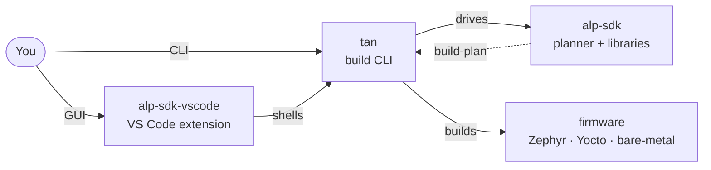
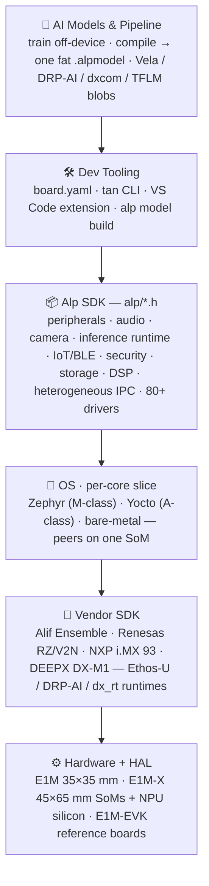

# ⚡ Alp Lab

**Edge AI hardware — and the software that runs on it.**

From the open **E1M** System-on-Module standard, through the **Alp SDK**
firmware framework that targets it, to **Signex**, our open-source AI-first
EDA tool.

---

## 🧩 The two stacks

### 🤖 Edge AI · E1M + Alp SDK

- **[E1M Standard 1.2](https://github.com/alplabai/e1m-spec)** — open,
  silicon-agnostic pinout + mechanical envelope for AI-capable
  Systems-on-Module in two form factors: **E1M** (35 × 35 mm, 312 pads)
  and **E1M-X** (45 × 65 mm, 496 pads).  The standard fixes the universe
  of pads and which signals each may carry; silicon variants — ALP-AEN
  (Alif Ensemble), ALP-X-V2N (Renesas RZ/V2N), ALP-X-V2N-M1 (DRP-AI3 +
  DEEPX M1) — declare their routed subset in per-variant SoM manifests.
  Any vendor can ship pin-compatible modules; any product board targets
  one connector and accepts multiple SoMs.
- **[Alp SDK](https://github.com/alplabai/alp-sdk)** — unification C/C++
  firmware framework for E1M modules.  A single `board.yaml` drives
  Zephyr, Yocto, and bare-metal builds across Alif Ensemble, Renesas
  RZ/V2N, NXP i.MX 93, and DEEPX DX-M1 silicon — single-OS or
  heterogeneous (Zephyr + Yocto + bare-metal coexisting on one SoM from
  one declarative project).  Ships with 80+ chip drivers, ML inference
  dispatch (TFLite Micro → Ethos-U / DRP-AI / DEEPX), runtime hardware
  identification (ADC + on-module EEPROM manifest), and a VS Code
  configurator.
- **[tan](https://github.com/alplabai/tan-cli)** — the standalone Rust
  build CLI that turns an Alp SDK project into firmware.  One command
  surface (`tan build` / `validate` / `doctor` / `generate` / …) reads a
  `board.yaml`, drives the SDK planner, and produces a Zephyr / Yocto /
  bare-metal image end-to-end.  The VS Code extension shells the **same
  `tan` binary** — install `tan` + an SDK checkout and you build from the
  terminal with no editor required.

### ✏️ Open EDA · Signex

- **[Signex](https://github.com/alplabai/signex)** is an open-source,
  AI-first EDA suite built in Rust with GPU-accelerated rendering and an
  Altium Designer-quality UI — schematic + PCB editor, 3D viewer,
  simulation, plugin system.  Native file formats (`.snxsch`, `.snxpcb`,
  `.snxsym`, `.snxfpt`) are line-diffable in git and ~5× smaller than the
  equivalent JSON.  Migrating from KiCad?  The optional
  [signex-kicad-import](https://github.com/alplabai/signex-kicad-import)
  companion (GPL-3.0-or-later, distributed independently) converts
  `.kicad_sch` / `.kicad_pcb` / `.kicad_pro` one-way to Signex's native
  formats.
  - **Signex Community** (Apache-2.0) — full schematic + PCB editor, 3D
    viewer, simulation, plugin system.  Free forever.
  - **Signex Pro** (subscription) — adds Signal AI (Claude-powered design
    copilot), real-time collaboration, and Signex 365 cloud PLM.

---

## 🔗 How the toolchain fits together (user's view)

You drive **one command surface**; it fans down to the SDK and out to a
firmware image.  The VS Code extension is a GUI over the same `tan` binary
— nothing you can do in the editor is off-limits from the terminal.

## 🏗 The Alp SDK layer stack

A `board.yaml` at the top compiles down to silicon.  Every layer is
declarative and swappable — change the SoM, keep your source.

---

## 📊 Current status

- **Alp SDK — `v0.11.1`.**  Every chip driver, peripheral wrapper, and
  example builds clean on `native_sim`; two SoM families now carry
  silicon evidence — E1M-X V2N (verified v0.6) and E1M-AEN801 (Alif
  Ensemble E8 peripheral matrix + NPU inference, verified v0.8).
  Remaining families (i.MX 93, V2N-M1/DEEPX, AEN30x–70x) are pre-silicon.
- **Signex — `v0.14.0`, the Footprint Editor milestone.**  The `.snxfpt`
  pad + parametric-sketch editor is live (Apache-clean Newton-LM
  constraint solver, 19 constraint kinds, bake to pads / silk /
  courtyard).  Carries forward the v0.13 clean-room schematic renderer and
  the Symbol & Library surfaces (`.snxsym` envelope, Library Browser,
  Pick Symbol / Footprint).

---

## 📚 Featured repositories

### 🤖 Edge AI · E1M + Alp SDK

| Repository | Description |
|---|---|
| [**alp-sdk**](https://github.com/alplabai/alp-sdk) | Unification C/C++ SDK for E1M Systems-on-Module — Zephyr / Yocto / bare-metal |
| [**tan**](https://github.com/alplabai/tan-cli) | Standalone Rust build CLI — the executor + command surface over an alp-sdk project (`board.yaml` → firmware) |
| [**alp-sdk-vscode**](https://github.com/alplabai/alp-sdk-vscode) | VS Code extension — schema-aware `board.yaml` editor, GUI configurator; shells the `tan` CLI |
| [**alp-sdk-community**](https://github.com/alplabai/alp-sdk-community) | Community-contributed chip drivers + libraries (Tier 2) — consumable from the alp-sdk workspace |
| [**e1m-spec**](https://github.com/alplabai/e1m-spec) | E1M open-standard pinout + mechanical envelope (35×35 / 312-pad + 45×65 mm / 496-pad) |
| [**alp-zephyr-modules**](https://github.com/alplabai/alp-zephyr-modules) | Out-of-tree Zephyr board files for the E1M-* EVKs |

### ✏️ Open EDA · Signex

| Repository | Description |
|---|---|
| [**signex**](https://github.com/alplabai/signex) | Signex EDA suite — Rust + Iced 0.14 + wgpu; native `.snx*` formats |
| [**signex-kicad-import**](https://github.com/alplabai/signex-kicad-import) | GPL-3.0 one-way KiCad → Signex converter (distributed independently) |
| [openEMS](https://github.com/alplabai/openEMS) | EC-FDTD electromagnetic solver (fork with fixes and CUDA engine) |
| [elmerfem](https://github.com/alplabai/elmerfem) | Elmer FEM solver (fork for thermal and DC IR drop analysis) |

---

## 🧰 Tech stack

**Edge AI**: Zephyr RTOS, Yocto, Alif Ensemble, Renesas RZ/V2N, NXP
i.MX 93, DEEPX DX-M1, TFLite Micro, Arm Ethos-U, Renesas DRP-AI, MbedTLS,
LVGL, CMSIS-DSP.  Toolchain: `tan` build CLI (Rust), VS Code extension
(TypeScript).

**EDA**: Rust, wgpu, Iced 0.14, native `.snx*` file formats, ngspice
(SPICE), OpenEMS (EM/FDTD), Elmer (FEM), Supabase (collaboration + PLM).

---

## 🚀 Get involved

- **[Alp SDK](https://github.com/alplabai/alp-sdk)** — embedded firmware
  on the open E1M pinout; rendered docs at
  [docs.alplab.ai/sdk/introduction](https://docs.alplab.ai/sdk/introduction),
  community at [community.alplab.ai](https://community.alplab.ai/).
- **[Signex](https://github.com/alplabai/signex)** — open EDA for
  schematic + PCB design; see the
  [contributing guide](https://github.com/alplabai/signex/blob/main/CONTRIBUTING.md)
  and pick up a [good first issue](https://github.com/alplabai/signex/labels/good%20first%20issue).
- Each repo carries its own `CONTRIBUTING` file + issue templates.
